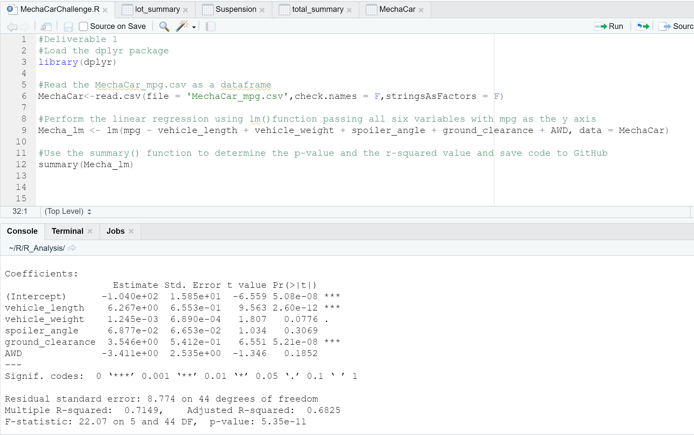
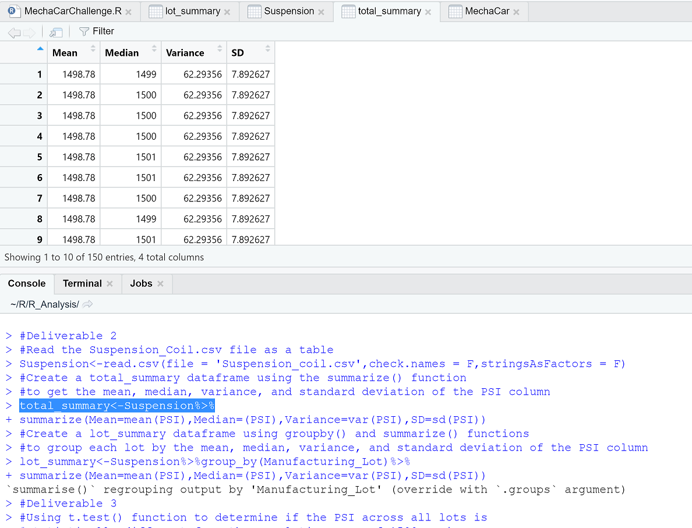
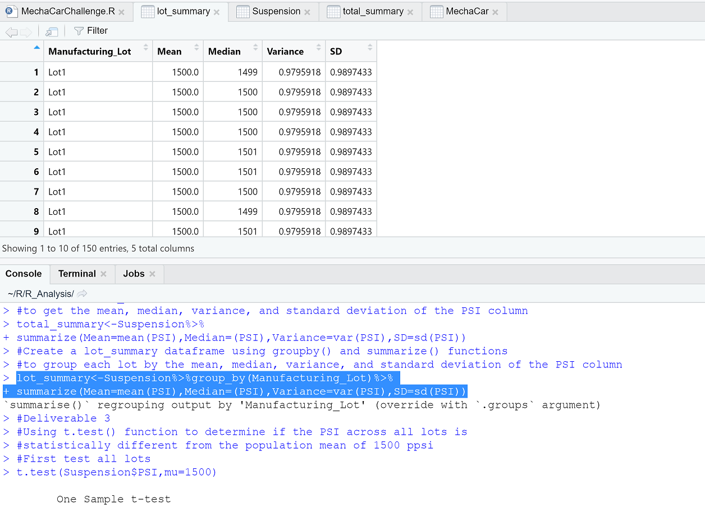
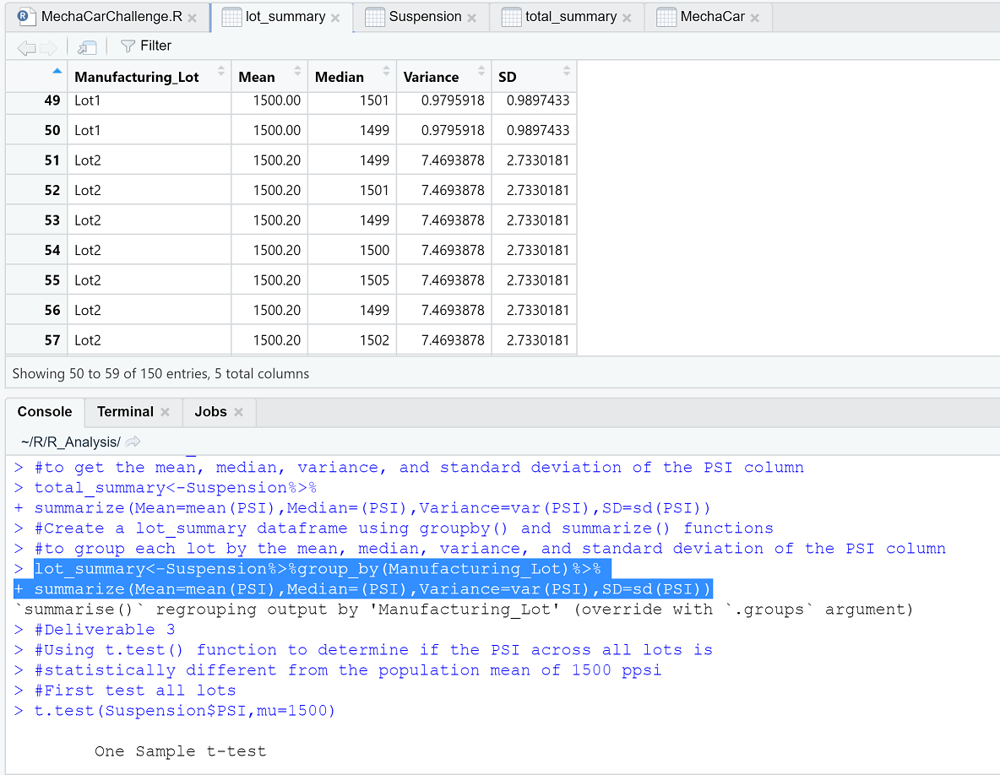
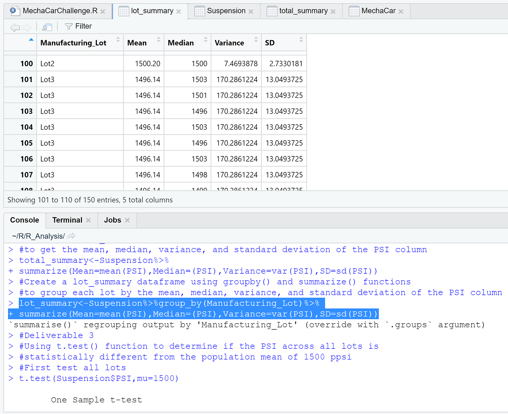
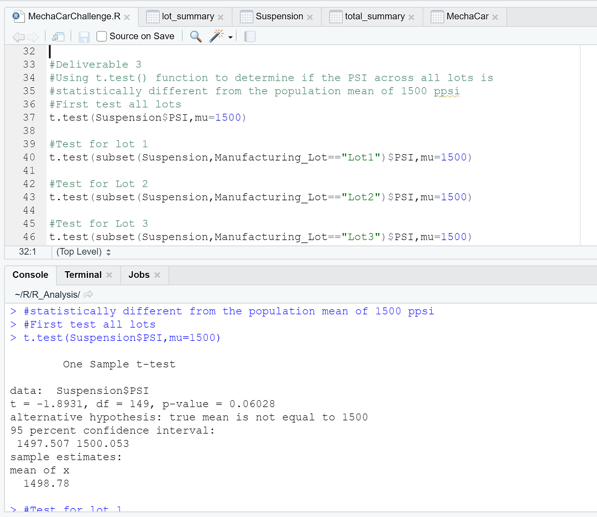
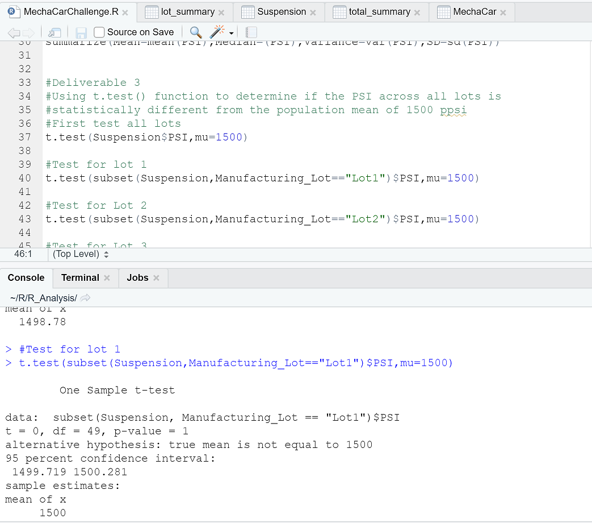
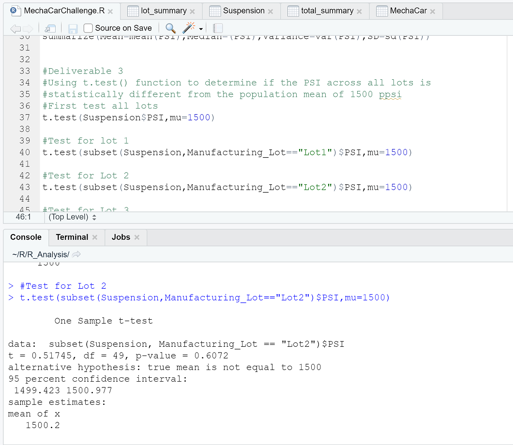

# MechaCar_Statistical_Analysis
## Background
AutosRUs is developing a new prototype vehicle, MechaCar. Jeremy, the data analytic's team leader was approached by upper management about a special project. MechaCar is suffering from production troubles that are blocking the manufacturing team’s progress. AutosRUs’ upper management has called on Jeremy and the data analytics team to review the production data for insights that may help the manufacturing team.

In this project the team will:
- Perform multiple linear regression analysis to identify which variables in the dataset predict the mpg of MechaCar prototypes
- Collect summary statistics on the pounds per square inch (PSI) of the suspension coils from the manufacturing lots
- Run t-tests to determine if the manufacturing lots are statistically different from the mean population
- Design a statistical study to compare vehicle performance of the MechaCar vehicles against vehicles from other manufacturers

## Linear Regression to Predict MPG
I've used the MechaCar_mpg.csv dataset and RScript to design the following multiple linear regression model for predicting 'miles per gallon' (mpg) statistics.

In the above picture, the variables/coefficents' p-values (Pr(>|t|)) are: 

- vehicle length (2.60e-08)
- vehicle weight(0.0776)
- spoiler angle(0.3069)
- ground clearance(5.21e-08)
- AWD(All Wheel Drive)(0.1852) 

### 1.) Which variables/coefficients provided a non-random amount of variance to the mpg values in the dataset?
From the dataset results it is possible to predict that the following variables/coefficients provided a non-random amount of variance to the mpg values: 
 - vehicle weight(0.0776)
 - spoiler angle(0.3069)
 - AWD(All Wheel Drive)(0.1852) 

### 2.) Is the slope of the linear model considered to be zero? Why or why not?
P-values (probability values) for the above variables are smaller than our significance level of 0.05. For example, the following is a calculation of the significance level for vehicle weight: 0.076 -1 = 0.9224 or 92.2%. The desired significance level is 0.05 - 1 = 0.95 or 95%). All 3 variable/coefficients are predicted to be outside the 95% minimum significance level based on the data used for the linear model. The intersept value (5.08e-08) in this model is statistically significant as well which means it is possibile other variables/coefficients may contribute to the variation in mpg that have not been included in our model (nor in the provided dataset). Additional values may still need to be collected or observed to increase the power of the analysis predeiction. The slope of the linear model is not considered to be zero because the p-value is less than 0.05. 

### 3.)Does this linear model predict mpg of MechaCar prototypes effectively? Why or why not?
According to the summary output, the r-squared value is 0.71, which predicts that approximatley 71% of all mpg predictions will be correct when using this linear model. In addition, the p-value of the linear model is 5.35e-11 (last line of the above picture in the F-statistic results), which is smaller (94.65%) than the desired significance level of 0.05 (95%).

## Summary Statistics on Suspension Coils

### The design specifications for the MechaCar suspension coils dictate that the variance of the suspension coils must not exceed 100 pounds per square inch. Does the current manufacturing data meet this design specification for all manufacturing lots in total and each lot individually? Why or why not?
The 'total_summary' for all 3 lots reveals the mean is steady at 1498.78 in all 150 rows of the total_summary table. The variance is reported at 62.29356 for all 150 rows of the total_summary table. The standard deviation is reported at 7.892627 for all 150 rows of the total_summary table. The median value of the table varies between 1452 and 1542. The variance of the PSI sample distribution and the standard deviation are well within the design specifications for all 3 lots and does not exceed 100 pounds per square inch.

Results of data analysis on the 3 suspension coil lots predicts that Lot 1 and Lot 2 meet design specification because the variance and standard deviation are under 100 pounds per square inch. However, Lot 3 does not predict to design specifications because variance and standard deviation are greater than 100 pounds per square inch.

## T-Tests on Suspension Coils

 

The results of the t-test analysis reveals that the p-value for all lots is 0.06028 which is outside the signifigance level of 0.05 resulting in a confidence interval of 93.972%. Based on this prediction, there is not sufficient evidence to reject the null hypothesis. It may be stated that the dataset mean and the population mean are statistically similar. Also, the analysis predicts that the suspension coils dataset is statistically representative of the population mean. 

## Study Design: MechaCar vs Competiiton
The plan is to design the MechaCar vehicle to perform better than the general marketplace vehicles. To accomplish this goal I believe atttention is best served improving the fuel efficiency of the MechaCar. Data needs to be gathered for all MechaCar manufacturing designs, in addition to the current six variables from this analysis. Additional data could include weather conditions, i.e. wind sheer, rain, heat, etc. Varying distances of short trips and long trips are also needed to determine fuel efficiency, as well as fuel efficiency over time. The dataset must include general marketplace competitor's data for comparison.

### What metric or metrics are you going to test?
The data will meet the following metrics:
- All data is to be numerical
- Data samples will be as large as possible
- Data samples need to be randomly selected
- Variance of data needs to be similar

### What is the null hypothesis or alternative hypothesis?
HO: There is no statistical difference between the competition's mpg dataset and MechaCar's mpg dataset.

Ha: The true mean of MechaCar's mpg is greater than the mean of the competitor's mpg.

### What statistical test would you use to test the hypothesis? And why?
I reccomend using the t-test to compare our dataset with the competitors. The t-test has already been used for this current analysis and provided the predictions needed to take the next steps for improvement.

### What data is needed to run the statistical test?
The p-value would be set at 0.05. Data that results in a prediction of a p-value smaller than 0.05 would provide predictive evidence that the null hypothesis could be rejected and state that the Ha is true. Providing evidence that the Ha is true would also predict that the MechaCar provides consistently better fuel efficiency than the competitors mpg. There is always room for error and better fuel efficiency may not happen all of the time, but at least 95% of the time.

this concludes my analysis PEM
